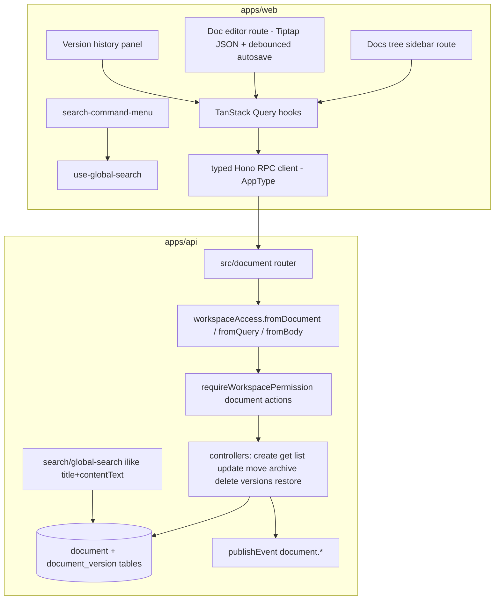

# Documents Module (Notion-style Docs) - Plan

## Goal Capsule

- **Objective:** Add a workspace-scoped, permission-guarded documents module to Kaneo — nested rich-text pages with a Tiptap editor, debounced autosave, version snapshots with restore, archive, and command-palette search.
- **Authority hierarchy:** Existing codebase conventions win over this plan's field-level sketches; this plan's Product Contract wins over implementer preference; `CLAUDE.md`'s anti-over-engineering rule (build only what is asked) governs throughout.
- **Execution profile:** Additive module on the Kaneo fork. Touch core files only where the pattern requires it (route registration in `apps/api/src/index.ts`, `workspaceAccess` lookup union, permission statements, search picklist, nav array, i18n catalogs).
- **Stop conditions:** Stop and surface if the permission merge-backfill (U2) proves infeasible against the existing seeder, if the Hono RPC `AppType` union cannot accommodate the new route without breaking the typed client, or if drizzle cannot generate a valid self-referencing FK migration.
- **Tail ownership:** The invoking pipeline owns simplify/review/ship; this plan ends at verified implementation.

---

## Product Contract

### Summary

Kaneo gets a docs tab: users create pages inside a workspace, nest them in a tree, edit rich text that autosaves, browse and restore version snapshots, archive pages, and find docs from the existing search command menu. All access is guarded by workspace membership and a new `document` permission resource.

### Problem Frame

Kaneo has tasks, boards, and RBAC but no place for prose. Teams pair it with an external wiki, splitting context. Phase 1 of the Open Enterprise Workspace direction brings documents into the same workspace, on the same permission model, as a foundation for later board-in-doc embeds.

### Requirements

**Document CRUD and nesting**

- R1. A workspace member can create a document in a workspace; it defaults to title "Untitled" with empty content.
- R2. Documents nest via a parent reference; the docs UI renders them as a collapsible tree ordered by `sortOrder`.
- R3. A document can be moved to a new parent and/or position; moving a document keeps its subtree intact.
- R4. Archiving a document soft-hides it (and its subtree) from the tree; archived documents can be restored or permanently deleted.

**Editing and autosave**

- R5. The editor persists ProseMirror JSON via debounced autosave; a saved indicator reflects pending/saved state.
- R6. The server derives a plaintext `contentText` from the JSON on every content update (per KTD2).
- R7. Version snapshots are captured server-side per the cadence in KTD3; a user can list versions and restore one, which itself snapshots the pre-restore state first.

**Access control**

- R8. Every document route requires workspace membership; mutating routes additionally require the corresponding `document` permission action (per KTD4).
- R9. Every existing workspace works without manual intervention: default roles (admin/member/viewer) receive the new `document` permissions via the seeder merge-backfill, and the static `owner` role receives them in code (per KTD4).

**Search**

- R10. Documents appear in global search, matched by title or content text, and open the doc page when selected from the command menu.

**Events**

- R11. Document create/update/archive/delete/restore publish `document.*` events on the existing event bus (no new subscribers this run).

### Scope Boundaries

- **Deferred to follow-up work:** kanban-board-in-doc embed node; doc-level sharing/permissions beyond workspace roles; project-attached docs in the UI (the `projectId` column ships now, unused by v1 UI); real-time multiplayer (Yjs); doc export; websocket presence/live-refresh for docs; stale-write detection (`updatedAt` precondition → 409 surfaced in the editor).
- **Outside this run:** 2FA, SSO, audit log, SCIM (later phases of the roadmap).

---

## Planning Contract

### Key Technical Decisions

- KTD1. **Editor: plain Tiptap 3.x from the deps already installed** — build the doc editor on `@tiptap/react` + `starter-kit` + existing extensions (v3.28, already in `apps/web/package.json`), following the debounce/autosave patterns in `apps/web/src/components/task/task-description.tsx`. Chosen over BlockNote: no new dependency, no second UI system beside the coss kit, and the existing task editor is the in-repo pattern. Unlike the task editor (markdown strings), the doc editor persists `editor.getJSON()`.
- KTD2. **Storage: ProseMirror JSON in `jsonb` + server-derived `contentText`** (session-settled: user-directed — chosen over markdown/HTML storage: enables later block embeds and editor portability). The update controller walks the JSON and concatenates text nodes into `contentText`; deriving server-side keeps search consistent regardless of client.
- KTD3. **Single-writer autosave + server-side version snapshots** (session-settled: user-directed — chosen over Yjs/Hocuspocus multiplayer: deferred to a later phase as the hardest part of the roadmap). Snapshot rule: on a content update, if the document has no version yet or its newest version is older than 10 minutes, snapshot the document's current *stored* (pre-update) content before applying the incoming content — capturing the state being replaced guarantees the last good state before a destructive edit is always recoverable; also snapshot the pre-restore content before a version restore. Versions are content-only: title changes neither snapshot nor restore, and the snapshot rule fires only when `content` is present in the update payload. Cap retained versions at 50 per document (delete oldest beyond cap in the same transaction).
- KTD4. **New `document` permission resource with seeder merge-backfill** — add `document` to the permission statement in `packages/permissions`, grant it on the compiled role objects **including the static `owner` role**, extend `defaultRolePayloads`, and extend `apps/api/src/utils/seed-default-workspace-roles.ts` to merge missing resources into existing default-role DB rows. Chosen over piggybacking on `project` permissions: docs need their own resource for the later enterprise phases, and without the backfill every non-owner in an existing workspace gets 403 (the permission util prefers DB `workspace_role` rows, and the seeder is insert-only today). `owner` is deliberately excluded from `DEFAULT_ROLE_NAMES` and resolves via compiled statements, never DB rows — so it must be granted in code, not by the seeder. The merge touches only `is_default` roles and only adds missing resource keys — custom roles are never modified.
- KTD5. **Workspace resolution via a new `document` lookup** — extend the `lookup` union and `lookupWorkspaceId` switch in `apps/api/src/utils/workspace-access-middleware.ts` and add `workspaceAccess.fromDocument()`, mirroring `fromProject`. This is the sanctioned core-file edit; there is no hook alternative.
- KTD6. **Tree assembly on the client from a flat list** — the list endpoint returns all non-archived documents for a workspace (id, parentId, title, icon, sortOrder, updatedAt — no content); the web builds the tree. Chosen over a recursive SQL CTE: simpler, and per-workspace doc counts are small. Archived docs are fetched with a query flag.
- KTD7. **Fork discipline: additive modules** (session-settled: user-directed — chosen over greenfield app: Kaneo already has the task engine, RBAC, better-auth, and websockets). New code lives in new module directories; core files change only at the registration points named in the Goal Capsule.

### Assumptions

- Docs are workspace-level in v1 UI; `projectId` ships in the schema (nullable, `set null` on delete) for Phase 2 but no UI binds it.
- Snapshot cadence (10 min / 50 versions) is a tunable constant in the document module, not user-facing config.
- GET routes rely on workspace membership only (matching the `project` module); `document: ["read"]` exists in the statement for future granularity but is not enforced on reads in v1.
- No new websocket broadcasts for docs this run; `document.*` events publish with no subscribers.
- Concurrent writes are last-write-wins in v1 (two tabs or two users can overwrite each other between snapshots); an `updatedAt` precondition returning 409 is deferred to follow-up work.

### High-Level Technical Design

Update flow (the one non-obvious sequence): editor debounce fires → `PUT /document/:id` with JSON → controller in one transaction: derive `contentText`, apply snapshot rule (KTD3), update row → `publishEvent("document.updated")` → response refreshes query cache.

---

## Implementation Units

### U1. Schema and migration for documents

- **Goal:** `documentTable` and `documentVersionTable` exist with a generated migration.
- **Requirements:** R1, R2, R4, R6, R7.
- **Dependencies:** none.
- **Files:** `apps/api/src/database/schema.ts`, generated SQL under `apps/api/drizzle/`.
- **Approach:**
  - Follow existing conventions exactly: `text("id").$defaultFn(() => createId()).primaryKey()`, singular snake_case pg names (`document`, `document_version`), FKs with `{ onDelete, onUpdate: "cascade" }`, timestamps `{ mode: "date" }` with `.$onUpdate` for `updatedAt`.
  - `document`: `workspaceId` (cascade), `projectId` nullable (`set null`), self-referencing `parentId` — use the `foreignKey()` helper or `AnyPgColumn` callback (no in-repo precedent; `onDelete: "cascade"` so subtrees die with parents), `title` default "Untitled", `icon` nullable, `content` jsonb, `contentText` text, `sortOrder` integer default 0, `archivedAt` timestamp nullable, `createdBy` → `userTable.id`.
  - `document_version`: `documentId` (cascade), `content` jsonb notNull, `createdBy`, `createdAt`.
  - Indexes: `workspaceId`, `parentId` on `document`; `documentId, createdAt` on `document_version` (third-arg array form, `document_workspaceId_idx` naming).
  - Generate via `pnpm --filter @kaneo/api db:generate`; never hand-write SQL. Migrations auto-run at API boot.
- **Patterns to follow:** `projectTable`/`labelTable` declarations; `activityTable.eventData` for jsonb; `userNotificationWorkspaceProjectTable` for the `foreignKey()` helper shape.
- **Test scenarios:** Test expectation: none — schema-only unit; behavior is proven by U3's integration suite running against the migrated test database.
- **Verification:** migration generates cleanly and applies on a fresh `_test` database; `pnpm --filter @kaneo/api build` passes.

### U2. `document` permission resource and seeder merge-backfill

- **Goal:** Every role — including the static `owner` role and default roles in pre-existing workspaces — grants the intended `document` actions (R9, KTD4).
- **Requirements:** R8, R9.
- **Dependencies:** none.
- **Files:** `packages/permissions/src/index.ts`, `apps/api/src/utils/seed-default-workspace-roles.ts`, seeder tests in `tests/api-integration/` (primary home — the merge-backfill scenarios exercise `db` directly and need the real `_test` Postgres).
- **Approach:**
  - Add `document: ["create","read","update","delete"]` to the statement. Explicit grants: owner and admin get all four; member gets `["create","read","update"]` (mirroring the `task` member precedent — members edit content but do not hard-delete); viewer gets `["read"]`. Extend `defaultRolePayloads` accordingly.
  - Grant the actions on the compiled role objects themselves, including the static `owner` role export — owner has no `workspace_role` DB row by design (`DEFAULT_ROLE_NAMES` excludes it), so permission checks fall back to its compiled statements and the seeder cannot reach it.
  - Extend the seeder: for each existing `is_default` role row, merge in resource keys present in the compiled payload but absent from the stored permissions JSON; never overwrite existing keys or touch custom roles.
- **Patterns to follow:** existing statement/role shapes in `packages/permissions/src/index.ts` (owner's `task`/`label` arrays already mirror admin's); the seeder's current insert-only loop.
- **Test scenarios:**
  - Seeder run against a workspace with pre-existing default-role rows lacking `document` adds the key with the compiled actions.
  - Seeder leaves an existing resource's actions untouched when a role row already has them (including deliberately customized actions on a default role).
  - Seeder never modifies a non-default (custom) role row.
  - Fresh workspace creation seeds roles that include `document` from the start.
  - Workspace owner can create, update, archive, and delete a document (exercises the static-role path; end-to-end assertion lives in U3's suite).
- **Verification:** integration tests pass; both an owner and a member in a workspace created before the change can create a document (proven end-to-end in U3's suite).

### U3. Document API module, registration, events, integration tests

- **Goal:** Full `/document` API surface, wired into the app and typed client, with an integration suite.
- **Requirements:** R1, R2, R3, R4, R5 (server side), R6, R7, R8, R11.
- **Dependencies:** U1, U2.
- **Files:** `apps/api/src/document/index.ts`, `apps/api/src/document/controllers/*.ts` (one per operation: `create-document`, `get-document`, `list-documents`, `update-document`, `move-document`, `archive-document`, `delete-document`, `list-document-versions`, `restore-document-version`), `apps/api/src/schemas.ts` (add `documentSchema`, `documentVersionSchema`), `apps/api/src/utils/workspace-access-middleware.ts` (KTD5), `apps/api/src/index.ts` (registration), `tests/api-integration/document.test.ts`.
- **Approach:**
  - Mirror `apps/api/src/project/index.ts` route-for-route: chained Hono router (chaining is load-bearing for RPC types), `describeRoute` + valibot validators, `workspaceAccess.fromQuery/.fromBody/.fromDocument`, `requireWorkspacePermission({ document: [...] })` on mutations only.
  - Update controller implements KTD2 text derivation and the KTD3 snapshot rule (snapshot the pre-update stored content) in one `db.transaction`. The text derivation is an iterative (explicit-stack) walk with a bounded depth, not naive recursion. Create/update reject serialized `content` above a module-constant size cap (e.g. 1 MB, beside the snapshot cadence constants) with 400/413 — bounds both the crash vector and the 50-snapshot storage amplification.
  - Move controller validates the new parent is in the same workspace and is not the document itself or a descendant — the descendant/cycle check and the parent update run inside one `db.transaction`, with the `parentId` walk capped at a fixed depth (exceeded cap = rejected move).
  - `sortOrder`: new docs append at `max(sortOrder)+1` among siblings; move accepts an optional target position and renumbers affected siblings inside the same transaction.
  - List controller returns the flat non-archived set per KTD6 (no `content` payload); `?archived=true` returns archived docs. Get returns the full row.
  - Archive sets `archivedAt` on the document **and its entire descendant subtree** in one transaction; unarchive clears it for the same set (R4 — otherwise non-archived children of an archived parent resurface at the tree root). Delete is hard-delete, allowed only for archived documents; the FK cascade removes the (fully archived) subtree.
  - Publish `document.created|updated|moved|archived|deleted|restored` per the `<entity>.<past_tense>` convention.
  - Register in `apps/api/src/index.ts` at all four places: `api.route("/document", ...)`, the `createApp()` return object, the top-level destructure, and the `AppType` union — missing the union silently breaks the typed web client.
- **Patterns to follow:** `apps/api/src/project/` module end-to-end; `tests/api-integration/project.test.ts` for suite shape (serial, real `_test` Postgres, helpers/mocks).
- **Test scenarios:**
  - Create returns an Untitled doc scoped to the workspace; owner and member can create; non-member gets 403; viewer (no `document:create`) gets 403.
  - Update persists JSON, derives `contentText` containing the document's visible text, and bumps `updatedAt`.
  - Snapshot rule: a content update past the cadence window captures a version equal to the *pre-update* stored content; a second update within the window does not snapshot; a title-only update never snapshots (make the cadence constant injectable/clock-controllable for the test).
  - Oversized `content` (above the size cap) is rejected; a deeply nested payload does not crash the contentText derivation.
  - Version cap: exceeding 50 versions prunes the oldest.
  - Restore swaps content in and snapshots the pre-restore state first; restoring a version from another document's id 404s.
  - Move re-parents correctly; moving under its own descendant is rejected; moving across workspaces is rejected.
  - Archive hides the doc *and its children* from the default list, `?archived=true` shows them; unarchive restores the same set; delete on a non-archived doc is rejected; delete on an archived doc removes it and its versions (cascade).
  - Cascade: deleting an archived parent removes its (archived) subtree.
  - Events: create/update publish `document.created`/`document.updated` (assert via a test subscriber).
- **Verification:** `pnpm --filter @kaneo/api test:integration` green including the new suite; OpenAPI docs render the new routes.

### U4. Global search covers documents

- **Goal:** Docs are findable from the command menu (R10).
- **Requirements:** R10.
- **Dependencies:** U1, U3.
- **Files:** `apps/api/src/search/index.ts`, `apps/api/src/search/controllers/global-search.ts`, `apps/web/src/components/search-command-menu/index.tsx`, `apps/web/src/hooks/queries/search/use-global-search.ts`, `apps/web/src/fetchers/search/global-search.ts`, a new `tests/api-integration/search.test.ts` (no search integration suite exists today; follow `project.test.ts` for shape).
- **Approach:** add `documents` to the `type` picklist and `searchResultSchema`; new `ilike` block over `title` and `contentText` scoped to the user's workspaces and excluding archived docs; extend the web `SearchResultItem` union and the three switches (navigate target → the U6 doc route, icon, group label).
- **Patterns to follow:** the existing per-entity blocks in `global-search.ts`; existing type-union handling in `search-command-menu`.
- **Test scenarios:**
  - Query matching a doc title returns it; matching only body text (via `contentText`) returns it.
  - Docs from workspaces the user is not a member of never appear.
  - Archived docs are excluded.
  - `type=documents` filters to docs only.
- **Verification:** integration tests green; manual command-menu search navigates to the doc.

### U5. Web data layer for documents

- **Goal:** Typed fetchers and TanStack Query hooks for every U3 endpoint, plus the capability-map entry.
- **Requirements:** R1-R5, R7 (client side), R8.
- **Dependencies:** U3.
- **Files:** `apps/web/src/fetchers/document/*.ts`, `apps/web/src/hooks/queries/document/*.ts`, `apps/web/src/hooks/mutations/document/*.ts`, `apps/web/src/hooks/use-workspace-permission.ts` (add a `document` capability entry).
- **Approach:** one fetcher per endpoint using `InferRequestType` off the RPC `client`; query hooks for list/get/versions with workspace-scoped keys; mutation hooks invalidate the list/get keys (update mutation should support optimistic or debounced-settle behavior consumed by U7).
- **Patterns to follow:** `apps/web/src/fetchers/project/` and matching hook directories.
- **Test scenarios:** Test expectation: none — thin typed wrappers; behavior is covered by U3 (API) and U6/U7 (consuming components). Add a colocated test only if a hook grows nontrivial logic (e.g. optimistic cache surgery).
- **Verification:** `pnpm --filter @kaneo/web build` type-checks against the extended `AppType`.

### U6. Docs routes, tree sidebar, nav entry, i18n

- **Goal:** A Docs section in the workspace UI: nav item, tree sidebar with create/rename/archive affordances, doc page shell.
- **Requirements:** R1, R2, R3, R4.
- **Dependencies:** U5.
- **Files:** `apps/web/src/routes/_layout/_authenticated/dashboard/workspace/$workspaceId/docs/index.tsx` and `docs/$documentId.tsx`, tree components under `apps/web/src/components/docs/`, `apps/web/src/components/nav-main.tsx`, locale catalogs under the repo-root `i18n/` directory (`en-US.json` plus all other locales via the i18n check's `--fix` variant), colocated component tests beside the tree component.
- **Approach:**
  - Build the tree client-side from the flat list (KTD6): group by `parentId`, sort by `sortOrder`; expand/collapse state local.
  - Create (root and child), inline rename, archive via context menu; archived section behind a toggle. Drag-to-reorder may ship as up/down "move" actions in v1 — full DnD is not required by R3.
  - States: an empty workspace shows a call-to-action to create the first doc; the list fetch shows a loading state and surfaces fetch errors (match existing query-error handling in the app).
  - Accessibility: the tree uses ARIA `tree`/`treeitem`/`group` roles with arrow-key expand/collapse and up/down navigation; icon-only create/rename/archive controls carry accessible names (i18n'd `aria-label`s).
  - Nav: one entry in the `nav-main.tsx` items array with a `t("navigation:sidebar.docs")` key.
  - Load the `coss` project skill before building UI components; use coss primitives.
- **Patterns to follow:** existing `$workspaceId` route dirs (`project/$projectId/*`); `app-sidebar.tsx`/`nav-main.tsx` conventions.
- **Test scenarios:**
  - Tree builder: flat list with nesting renders correct hierarchy and `sortOrder` ordering; a genuinely dangling `parentId` (e.g. stale cache row) falls back to root rather than disappearing.
  - Empty workspace renders the create-first-doc call-to-action.
  - Create-child places the new doc under the right parent and navigates to it.
  - Archive removes the node and its subtree from the default tree.
  - Permission gating: viewer sees no create/rename/archive affordances.
- **Verification:** `pnpm i18n:check` and `pnpm lint` green; web build green; manual walkthrough of create/nest/rename/archive.

### U7. Doc editor with debounced autosave

- **Goal:** Editing a doc persists ProseMirror JSON via debounced autosave with a save-state indicator (R5).
- **Requirements:** R5, R6 (consumes), R7 (triggers snapshots implicitly).
- **Dependencies:** U5, U6.
- **Files:** `apps/web/src/components/docs/doc-editor.tsx` (+ toolbar/extension config), wired into `docs/$documentId.tsx`; colocated test for the debounce/save-state logic.
- **Approach:** Tiptap 3.x per KTD1 — starter-kit plus the already-installed link/placeholder/task-list/table/code-block extensions; persist `editor.getJSON()` through the U5 update mutation on a debounce (mirror the task-description debounce interval); flush pending save on unmount/navigation; title edits save through the same endpoint (no snapshot, per KTD3). Formatting affordances: reuse the BubbleMenu and slash-command patterns from `task-description.tsx`, scoped to the extensions enabled for docs. Save-state indicator: a small inline element near the title with three states — saving (pending mutation), saved, and error (failed mutation; content retained client-side for retry). Stored content is untrusted input rendered only through the Tiptap schema: keep the link extension's default protocol validation (no permissive `isAllowedUri` override) and never render stored JSON via raw HTML.
- **Patterns to follow:** `apps/web/src/components/task/task-description.tsx` for debounce/autosave mechanics (diverging on JSON-vs-markdown persistence, per KTD1).
- **Test scenarios:**
  - Rapid successive edits produce one save call after the debounce window (fake timers).
  - Unmount with a pending edit flushes the save.
  - Save failure surfaces the error indicator state rather than silently dropping.
  - Loading a doc renders its stored JSON.
  - A doc containing a `javascript:` link href does not produce a clickable `javascript:` URI.
- **Verification:** colocated tests green; manual: type, wait, reload — content persists; indicator cycles pending→saved.

### U8. Version history UI with restore

- **Goal:** Users can list a doc's versions and restore one (R7).
- **Requirements:** R7.
- **Dependencies:** U3, U5, U7.
- **Files:** `apps/web/src/components/docs/doc-version-history.tsx`, wired into the doc page; uses U5 versions query + restore mutation.
- **Approach:** panel/dialog listing versions (timestamp, author) newest-first; restore calls the U3 endpoint, invalidates the doc query, and the editor re-renders restored content. A read-only preview of a selected version is optional polish — include only if cheap with the existing editor in read-only mode.
- **Patterns to follow:** existing coss dialog/panel usage; activity list rendering for the row shape.
- **Test scenarios:**
  - Version list renders in reverse-chronological order.
  - A doc with zero versions renders an empty-state message (reachable per KTD3 for fresh/rarely-edited docs).
  - Restore updates the visible editor content and the doc query cache.
  - Viewer (no `document:update`) sees no restore action.
- **Verification:** colocated/component tests green; manual restore round-trip works.

---

## Verification Contract

| Gate | Command | Applies to |
|---|---|---|
| Lint/format (Biome) | `pnpm lint` | all units |
| API integration tests (real `_test` Postgres) | `pnpm --filter @kaneo/api test:integration` | U1-U4 (incl. U2 seeder scenarios) |
| Web tests | `pnpm --filter @kaneo/web test` | U6-U8 |
| Type-safe builds | `pnpm build` (turbo) | all units |
| i18n completeness | `pnpm i18n:check` | U6 |
| End-to-end smoke | repo `verify` skill (local dev instance): create → nest → edit → reload → search → restore → archive | final |

Commit style: conventional commits enforced by commitlint (`feat(api): ...`, `feat(web): ...`).

## Definition of Done

- All eight units implemented in dependency order with their test scenarios covered and the Verification Contract gates green.
- Both the owner and a member of a workspace created *before* this change can create, edit, and archive docs (R9 proven, not assumed — the owner path exercises the static role, the member path the seeder backfill).
- Docs found via command-menu search navigate to the editor.
- No stray code from abandoned approaches; diff contains only the files each unit names plus generated artifacts (migration, route tree, i18n catalogs).
- No regression to existing suites (`pnpm test` green at root).
