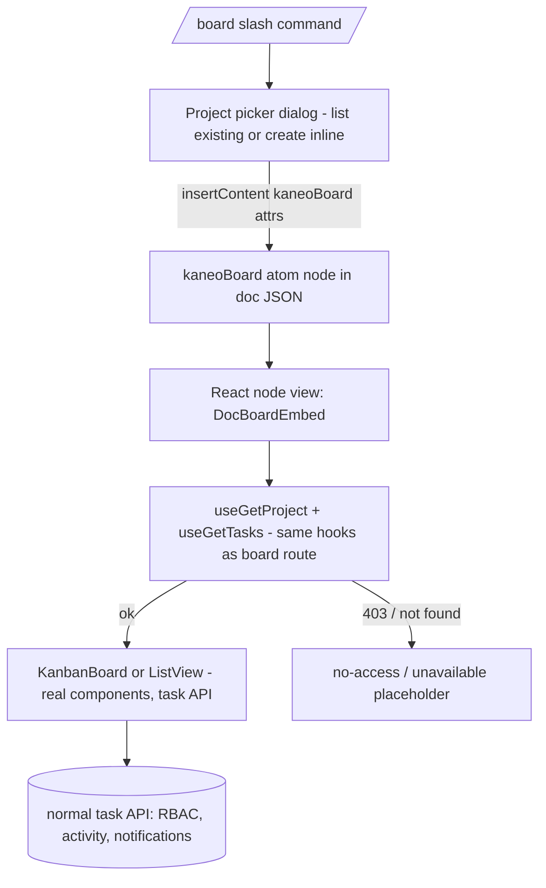

# Kanban Board Embeds in Docs - Plan

## Goal Capsule

- **Objective:** Docs can embed a live, fully interactive Kaneo project board (or list view) via a `/board` slash command — Phase 2 of the docs+boards workspace, built on the Phase 1 documents module on this branch.
- **Authority hierarchy:** Existing codebase conventions win over field-level sketches; the Product Contract wins over implementer preference; `CLAUDE.md`'s anti-over-engineering rule governs.
- **Execution profile:** Web-only feature (no API or schema changes — the embed consumes existing project/task APIs). Never fork or duplicate the board implementation.
- **Stop conditions:** Stop and surface if `KanbanBoard`/`ListView` cannot render outside their route without modifying those components' internals beyond adding optional props, or if node-view rendering breaks the Phase 1 editor's autosave round-trip.
- **Tail ownership:** The invoking pipeline owns simplify/review/ship; per standing user instruction the run commits and pushes to the fork but opens no PR.

---

## Product Contract

### Summary

Typing `/board` in a doc opens a project picker (existing projects in the workspace, or create one inline by name). Picking inserts a `kaneoBoard` block that renders the project's real board — the same component, data hooks, and task API as the project page, so RBAC, activity, and notifications work unchanged. Readers without project access see a quiet placeholder. The doc stores only `{ projectId, view }`.

### Problem Frame

Phase 1 gave Kaneo docs; boards still live only on project pages. The Notion-style promise of the roadmap is boards *inside* pages — a doc that is both prose and a working database view — without the doc layer duplicating any task state or logic.

### Requirements

**Embed node**

- R1. A `kaneoBoard` block node with attrs `{ projectId, view: "board" | "list" }` renders inside a doc; the doc JSON stores only those attrs (per KTD2).
- R2. The node view renders the existing `KanbanBoard` (or `ListView` when `view: "list"`) for that project, live and interactive: opening tasks, drag-and-drop, and edits all flow through the normal task API.
- R3. A view toggle on the embed switches board/list; for users who can edit the doc it persists to the node attrs, for doc viewers it is local-only.
- R4. The embed sizes to the doc column's full width with a fixed height and internal scroll; it never breaks the editor's layout.

**Insertion**

- R5. `/board` in the slash menu opens a picker listing the workspace's projects; selecting one inserts the node.
- R6. The picker offers inline project creation (name only; slug derived) and embeds the new project on success.

**Degraded states**

- R7. A reader who cannot access the embedded project sees a "no access" placeholder — never an error boundary, crash, or infinite spinner.
- R8. A deleted or nonexistent project renders a "project unavailable" placeholder; users with doc-edit rights can delete the block normally.

**Serialization**

- R9. Copy/paste of the block within the editor survives (attrs round-trip); the node's text/HTML serialization renders as a link to the project page (the doc layer has no full export pipeline yet — the node just defines its serialization so future exporters get a link for free).

### Scope Boundaries

- **Deferred to follow-up work:** `/table`, `/calendar`, `/timeline` embeds; filtering/sorting controls scoped to an embed; multiple simultaneous embeds of *different* projects interacting with bulk-selection shortcuts (see KTD5 caveat); a real doc export pipeline; embed-specific activity ("embedded in doc X") events.
- **Outside this run:** any API or schema change; board/list component redesign.

---

## Planning Contract

### Key Technical Decisions

- KTD1. **Live embed of the existing components via the task API** (session-settled: user-directed — chosen over copying/snapshotting board data into the doc: RBAC, activity, and notifications keep working with zero extra code). The node view mounts the real `KanbanBoard`/`ListView`; research confirms both take `{ project: ProjectWithTasks, disableDragDrop? }` and `DndContext` lives inside `KanbanBoard`, so no provider surgery is needed.
- KTD2. **Node serializes attrs only** (session-settled: user-directed — chosen over embedding task data in doc JSON: the doc layer never duplicates task state). Atom block node; `renderHTML` and `renderText` emit a project link (R9).
- KTD3. **Insertion via `/board` slash command with picker + inline creation** (session-settled: user-directed — chosen over picker-less insertion: the "new database in page" feel). Reuses the Phase 1 slash-menu machinery; picker is a coss dialog.
- KTD4. **Access check = fetch-and-handle-error, not a pre-flight permission call.** The embed wrapper fetches via `useGetTasks` (and `useGetProject` for header metadata); a 403/4xx query error renders the placeholder (R7/R8). This is the repo's idiomatic pattern — fetchers throw on `!response.ok` (discarding the HTTP status, so one neutral placeholder message is the realistic outcome) — and it is authoritative because the server applies the same `workspaceAccess` rules the project page uses. Disable the query's `refetchInterval` while errored so a no-access embed does not poll a 403 every 30s behind the placeholder.
- KTD5. **`useGetTasks(projectId)` is the sole board data source; accept the documented global-coupling caveats.** Its fetcher already returns the full `ProjectWithTasks` — the board route does `setProject(data)` directly and composes no merge helper; the embed renders from query data the same way. `useGetProject` is used only for the header name and error probing. Documented caveats accepted for v1: (a) `KanbanBoard`'s drag handler writes the embedded project into the shared `useProjectStore` slot and bulk-selection state is shared across visible embeds; (b) the embed renders from query data, so a drag briefly reverts then settles when `useUpdateTask` invalidates `["tasks", projectId]` — accepted repaint, not a bug; (c) `KanbanBoard` registers global j/k/Enter shortcuts on mount — the embed passes a new optional `disableShortcuts` prop (sanctioned by the Goal Capsule's optional-props allowance) to `KanbanBoard`/`ListView` so those shortcuts never hijack navigation from inside a doc.
- KTD6. **Fixed-height embed container** (e.g. ~480px, module constant) with internal horizontal/vertical scroll, full doc-column width. Chosen over auto-height: the board assumes `h-full` flex layouts and unbounded height would swallow the page scroll.

### Assumptions

- `view: "list"` ships in v1 — `ListView` shares `KanbanBoard`'s exact props, so the toggle is cheap (resolves the open area in favor of shipping both).
- The embed is interactive inline (no click-to-focus gate). The existing node-view precedents (`attachment-card`, `kaneo-issue-link`) are inline, non-draggable atoms — they do NOT validate block-drag-vs-internal-DnD behavior, which is why U1/U2 confine node dragging to a header drag handle (`data-drag-handle`) so a mousedown on a task card can never initiate a ProseMirror node drag.
- Inline project creation uses the existing create-project mutation (`name, slug, icon, workspaceId`); the project key is derived with `generateProjectSlug` from `apps/web/src/lib/generate-project-id.ts` (the create-project-modal precedent — uppercase short key; NOT `lib/utils/create-slug.ts`, which is the kebab-case workspace slugger); icon defaulted.
- No standalone "can I see project X" endpoint is added; KTD4 covers R7.
- Task-open is route-composed in Kaneo (`TaskCard` navigates with a `taskId` search param; the route renders `TaskDetailsSheet`) — the docs `$documentId` route therefore gains `validateSearch` for `taskId` and the embed hosts the sheet (U2); without this, card clicks silently no-op.

### High-Level Technical Design

---

## Implementation Units

### U1. `kaneoBoard` Tiptap node extension

- **Goal:** The node type exists, round-trips through doc JSON, and serializes as a project link (R1, R9, KTD2).
- **Requirements:** R1, R9.
- **Dependencies:** none.
- **Files:** `apps/web/src/components/docs/extensions/kaneo-board.ts` (or `.tsx` with the node view import), colocated test `kaneo-board.test.ts`.
- **Approach:** Atom block node (`group: "block"`, `atom: true`, `draggable: true`) with attrs `projectId` (string, required) and `view` (`"board" | "list"`, default `"board"`); node dragging is confined to a dedicated `data-drag-handle` grip in the embed's header row (Tiptap's drag-handle convention) so the board body never initiates a node drag; `parseHTML`/`renderHTML` via a `data-kaneo-board` element that degrades to an anchor to `/dashboard/workspace/:wsId/project/:projectId/board`; `renderText` emits the same URL; `addNodeView` wires `ReactNodeViewRenderer(DocBoardEmbed)` (component from U2). Register the extension in `doc-editor.tsx`'s extension list.
- **Patterns to follow:** `apps/web/src/components/task/extensions/kaneo-issue-link.tsx` and `attachment-card.tsx` (existing ReactNodeViewRenderer nodes).
- **Test scenarios:**
  - Inserting the node and reading `editor.getJSON()` yields the node with exact attrs; setting content from that JSON restores it (round-trip).
  - `getText`/text serialization of a doc containing the node includes the project link.
  - Node with a missing `view` attr defaults to `"board"`.
- **Verification:** editor tests pass; a doc containing the node saves and reloads through the Phase 1 autosave path without stripping the node.

### U2. `DocBoardEmbed` node view with degraded states

- **Goal:** The node renders the live board/list, with loading, no-access, and unavailable placeholders and the view toggle (R2, R3, R4, R7, R8).
- **Requirements:** R2, R3, R4, R7, R8; KTD1, KTD4, KTD5, KTD6.
- **Dependencies:** U1.
- **Files:** `apps/web/src/components/docs/doc-board-embed.tsx`, colocated test `doc-board-embed.test.tsx`, `apps/web/src/components/kanban-board/index.tsx` + `apps/web/src/components/list-view/index.tsx` (add optional `disableShortcuts` prop only), `apps/web/src/routes/_layout/_authenticated/dashboard/workspace/$workspaceId/docs/$documentId.tsx` (validateSearch for `taskId` + sheet wiring), i18n keys in root `i18n/*.json` (targeted per-locale insertion).
- **Approach:**
  1. `NodeViewWrapper` (non-editable atom) containing a header row (drag-handle grip, project name linkout, view toggle, open-in-project link) and a fixed-height body (KTD6 constant) with internal scroll. The header row is the node's selection surface: clicking it (or focusing via keyboard) selects the atom node so Backspace/Delete removes the block (R8) — the interactive board body cannot serve that role.
  2. Data: `useGetTasks(projectId)` is the sole `ProjectWithTasks` source (per KTD5 — its data feeds the board directly, as `board.tsx`'s `setProject(data)` shows); `useGetProject` supplies the header name. Disable refetch polling while the query is errored (KTD4).
  3. Query error → placeholder card: one neutral, quiet message ("This board can't be shown — you may not have access, or it may have been removed", i18n'd) per R7/R8 — placeholder never throws, never spins forever.
  4. `view` toggle: `updateAttributes` when `editor.isEditable`, local state otherwise (R3).
  5. Render `KanbanBoard` or `ListView` with the project, passing the new optional `disableShortcuts` prop (KTD5c) and `disableDragDrop` only if sorting invariants require it (mirror the route's condition).
  6. Task-open: add `validateSearch` for optional `taskId` to the docs `$documentId` route; `DocBoardEmbed` renders `TaskDetailsSheet(taskId, projectId, workspaceId)` when the location's `taskId` belongs to its project's task set, with `onClose` clearing the param (mirroring `board.tsx`'s `handleCloseTaskSheet`) — card clicks and focus-navigation open tasks from inside the doc (R2).
- **Patterns to follow:** board route composition in `routes/.../project/$projectId/board.tsx`; placeholder styling from Phase 1's docs empty states; `attachment-card.tsx` for NodeViewWrapper shape.
- **Test scenarios:**
  - With mocked hooks returning a project+tasks, the embed renders the board component (assert a column renders).
  - Query error state renders the placeholder — no thrown error, no crash (error boundary not triggered).
  - Loading state renders a skeleton, not a spinner-forever (assert skeleton role/testid).
  - View toggle with editable editor calls `updateAttributes({ view })`; with non-editable editor it does not touch attrs but switches the rendered component.
  - Missing project (error) with editable editor: node remains deletable (renders inside NodeViewWrapper with data-testid, no crash).
  - A task click surfaces `TaskDetailsSheet` inside the doc (mocked navigate/search wiring), and closing it clears the `taskId` param.
  - A mousedown-drag on a task card does not initiate the node-view drag path (drag handle confined to the header grip).
  - `KanbanBoard` receives `disableShortcuts` from the embed (assert prop; the prop's no-op behavior is unit-tested where the prop is added).
- **Verification:** web tests green; manual: embed a board in the dev instance, drag a task, confirm the change shows on the project page (same API).

### U3. `/board` slash command and project picker

- **Goal:** `/board` inserts an embed via picker or inline creation (R5, R6, KTD3).
- **Requirements:** R5, R6.
- **Dependencies:** U1, U2.
- **Files:** `apps/web/src/components/docs/board-picker-dialog.tsx` (+ test), `apps/web/src/components/docs/doc-editor.tsx` (SLASH_COMMANDS entry + dialog wiring), i18n keys.
- **Approach:**
  1. Add a `board` entry to `SLASH_COMMANDS` (group `insert`, search "board kanban project database") whose `run` deletes the slash range and opens the picker dialog (state in DocEditor, mirroring how the link prompt is handled). The command's label needs a key in the `tasks:detail.editor.slash.commands` namespace (where the slash menu resolves labels), not only a docs namespace.
  2. Dialog lists workspace projects (`useGetProjects`) with search; selecting inserts `kaneoBoard` at the stored range via `insertContent`. States: zero projects in the workspace → prompt straight into create mode; search with no matches → distinct no-results message.
  3. "Create new project" mode — shown only when `useWorkspacePermission().canCreateProjects()` (matching `nav-projects.tsx`'s gate): single name field; project key via `generateProjectSlug`, default icon; on success inserts the embed and closes; on mutation failure the dialog stays open in create mode with an inline error.
  4. Cancel restores focus to the editor without inserting.
- **Patterns to follow:** Phase 1's slash-command entries and version-history dialog composition (coss Dialog); existing create-project usage for field shapes.
- **Test scenarios:**
  - `/board` command opens the dialog (mocked); selecting a project inserts a node with that projectId at the slash position.
  - Inline create calls the create mutation with name + `generateProjectSlug` key + workspaceId and inserts the returned project's id.
  - Create-mutation failure keeps the dialog open in create mode with an inline error (nothing inserted).
  - Zero-projects workspace renders the create-first prompt; a search with no matches renders the no-results message.
  - A member without `project:create` sees no create mode in the picker.
  - Cancel inserts nothing and the slash text is gone (range was deleted on open).
  - Viewer (non-editable editor) does not see `/board` (slash menu already gated on editability — assert the command is absent or menu doesn't open).
- **Verification:** web tests green; manual: `/board` → pick → live board appears; `/board` → create "Test Board" → new empty board embedded and visible on the Projects page too.

---

## Verification Contract

| Gate | Command | Applies to |
|---|---|---|
| Lint/format (Biome) | `pnpm lint` | all units |
| Web tests | `pnpm --filter @kaneo/web test` | U1-U3 |
| Type-safe build | `pnpm --filter @kaneo/web build` + `npx tsc -p apps/web/tsconfig.json --noEmit` (keep 0 errors) | all units |
| i18n completeness | `pnpm i18n:check` (no new failures vs baseline) | U2, U3 |
| End-to-end smoke | local dev instance: `/board` → pick project → drag a task in the embed → verify on project page; viewer-permission spot check | final |

## Definition of Done

- All three units implemented in order with their test scenarios covered and gates green.
- A doc containing a board embed survives the full Phase 1 lifecycle: autosave, reload, version snapshot + restore (the node is plain JSON attrs — restore must re-render the live board).
- A workspace member without project visibility sees the placeholder (verified with mocked error state in tests; manual check when feasible).
- No API or schema changes in the diff; no duplicated board logic.
- No stray code from abandoned approaches.
